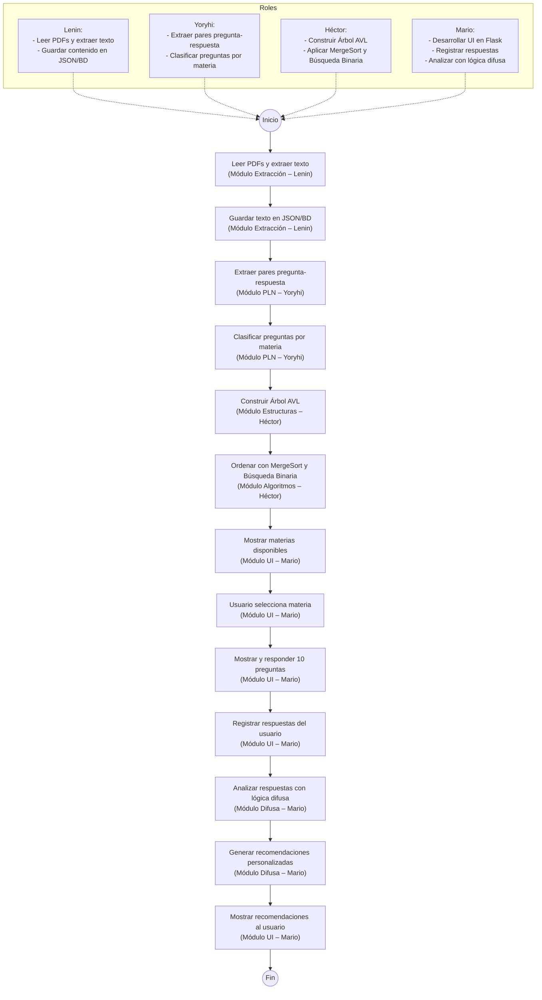

# FuzzMap

> **Asistente de Estudio Inteligente** para estudiantes universitarios, que automatiza la organización, evaluación y recomendación de contenido educativo utilizando árboles AVL, lógica difusa y técnicas de PLN.

---

## 📋 Tabla de Contenidos

- [Tema de Investigación](https://github.com/RosariosTijeras/FuzzMap#-tema-de-investigaci%C3%B3n)
- [Descripción del Proyecto](https://github.com/RosariosTijeras/FuzzMap#-descripci%C3%B3n-del-proyecto)
- [Equipo de Desarrollo](https://github.com/RosariosTijeras/FuzzMap#-equipo-de-desarrollo)
- [Diagrama de Flujo](https://github.com/RosariosTijeras/FuzzMap#-diagrama-de-flujo)
- [Características Principales](https://github.com/RosariosTijeras/FuzzMap#-caracter%C3%ADsticas-principales)
- [Estructura de Carpetas](https://github.com/RosariosTijeras/FuzzMap#-estructura-de-carpetas)
- [Cómo Empezar](https://github.com/RosariosTijeras/FuzzMap#%EF%B8%8F-c%C3%B3mo-empezar)
<!-- [Asignación de Tareas](#asignación-de-tareas)
- [Tecnologías y Librerías](#tecnologías-y-librerías) --> 


---

## 🎓 Tema de Investigación

**Diseño de un asistente inteligente para el estudio universitario mediante árboles AVL, lógica difusa y procesamiento de lenguaje natural**

---

## 🧩 Descripción del Proyecto

**FuzzMap** es una aplicación modular desarrollada en Python que tiene como objetivo asistir a estudiantes universitarios en su proceso de aprendizaje. El sistema realiza las siguientes tareas:

1. **Leer documentos PDF** para extraer preguntas y respuestas.  
2. **Procesar el contenido** usando técnicas de procesamiento de lenguaje natural (PLN) para clasificar las preguntas según la materia.  
3. **Organizar y almacenar las preguntas** en un **árbol AVL**, permitiendo búsquedas eficientes y ordenadas.  
4. **Evaluar respuestas del usuario** utilizando **lógica difusa**, lo cual permite una calificación más flexible y contextual.  
5. **Generar recomendaciones personalizadas** de estudio a través de una interfaz web interactiva construida con **Flask**.

Este enfoque permite un aprendizaje guiado y adaptativo, ofreciendo una herramienta útil y eficiente para estudiantes universitarios.

---

## 👥 Equipo de Desarrollo

| Integrante | Rol                                    |
|------------|----------------------------------------|
| Mario      | Interfaz (Flask) y Lógica Difusa   |
| Lenin      | Extracción de PDFs y Preprocesamiento  |
| Yoryhi     | Procesamiento de Lenguaje Natural (PLN)|
| Héctor     | Estructuras de Datos (Árbol AVL, Algoritmos) |

---

## 📊 Diagrama de Flujo



---

## 🚀 Características Principales

1. **Extracción de Contenido PDF**  
   - Utilizamos `PyMuPDF` o `pdfminer.six` para leer archivos PDF y extraer texto útil para el análisis.

2. **Procesamiento de Lenguaje Natural (PLN)**  
   - Clasificamos preguntas por materia con herramientas como `spaCy` y `NLTK`.  
   - Se identifican preguntas y respuestas usando heurísticas de formato y contexto.

3. **Estructura de Datos: Árbol AVL**  
   - Cada pregunta se inserta en un árbol AVL balanceado, lo que permite acceder rápidamente por tema o tipo.

4. **Evaluación con Lógica Difusa**  
   - A través de `scikit-fuzzy`, analizamos el rendimiento del estudiante no sólo por exactitud, sino por cercanía o calidad de sus respuestas.

5. **Interfaz Web (Flask)**  
   - El usuario puede elegir una materia, responder preguntas y recibir recomendaciones desde una aplicación web simple e intuitiva.

---

## 🗂 Estructura de Carpetas

```text
FuzzMap/
├── Ejemplo/
├── Datos/
│   ├── Habilidades_Vida/
│   └── Ciencia_Datos/
├── Modulos/
│   ├── extraction/
│   │   ├── __init__.py
│   │   └── pdf_extractor.py
│   ├── nlp/
│   │   ├── __init__.py
│   │   └── text_classifier.py
│   ├── avltree/
│   │   ├── __init__.py
│   │   └── avl_tree.py
│   ├── fuzzylogic/
│   │   ├── __init__.py
│   │   └── fuzzy_evaluator.py
│   └── ui/
│       ├── __init__.py
│       └── app.py
├── Notebooks/
├── main.py
├── requirements.txt
└── README.md
```

---

## 🛠️ Cómo Empezar

1. **Clonar el repositorio**  
   ```bash
   git clone https://github.com/RosariosTijeras/fuzzmap.git
   cd fuzzmap
   ```

---


2. **Crear y activar un entorno virtual**

Tienes dos opciones: usar Python venv o Conda.


---

#### Opción A: Usar Python venv (nativo de Python)

**Crear entorno:**
```bash
python -m venv .venv
```

#### Activar entorno:

- **En Linux/macOS:**
```bash
source .venv/bin/activate
```

- **En Windows (CMD o PowerShell):**
```bash
.\.venv\Scripts\activate
```

---

### Opción B: Usar Conda

**Crear entorno con nombre personalizado (por ejemplo fuzzmap):**
```bash
conda create -n fuzzmap python=3.11
```

**Activar entorno:**
```bash
conda activate fuzzmap
```


---

3. **Instalar dependencias desde `requirements.txt`**

Con el entorno virtual activado (ya sea venv o conda), ejecuta:
```bash
pip install -r requirements.txt
```

> Asegúrate de estar ubicado dentro de la carpeta fuzzmap/ al momento de ejecutar este comando.


---
