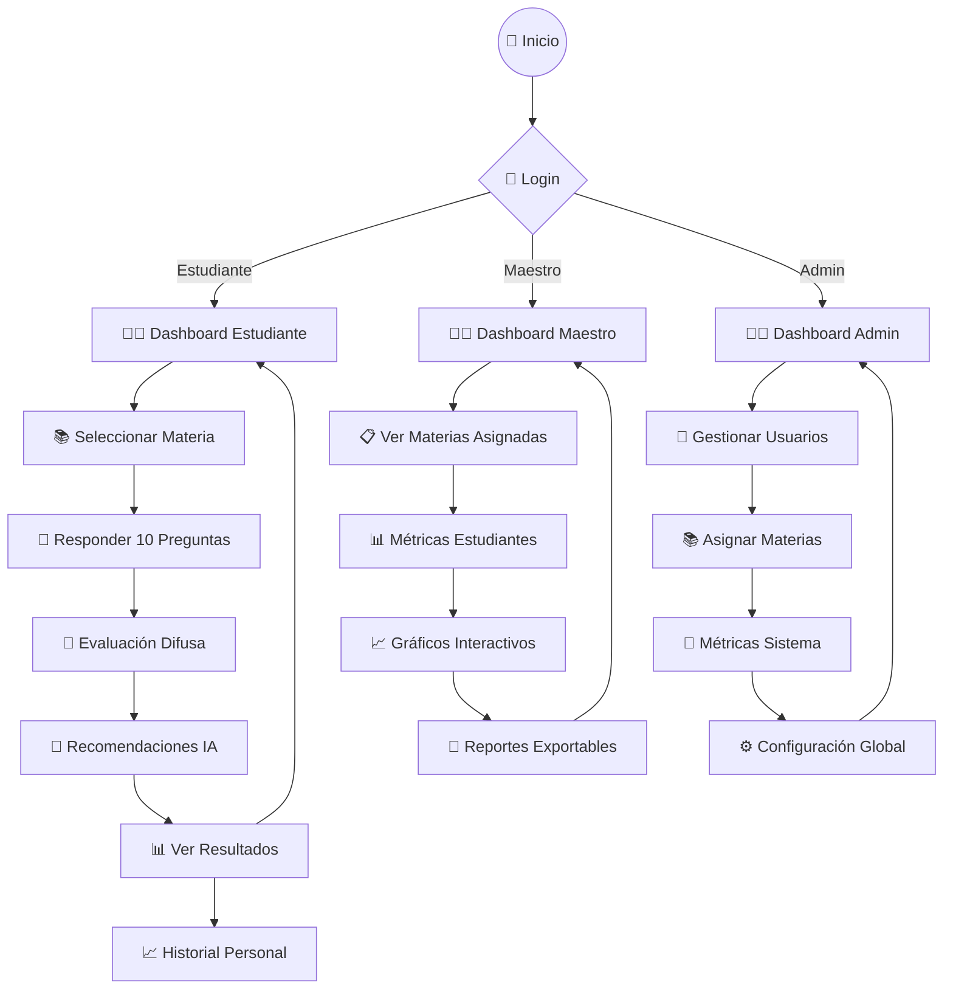
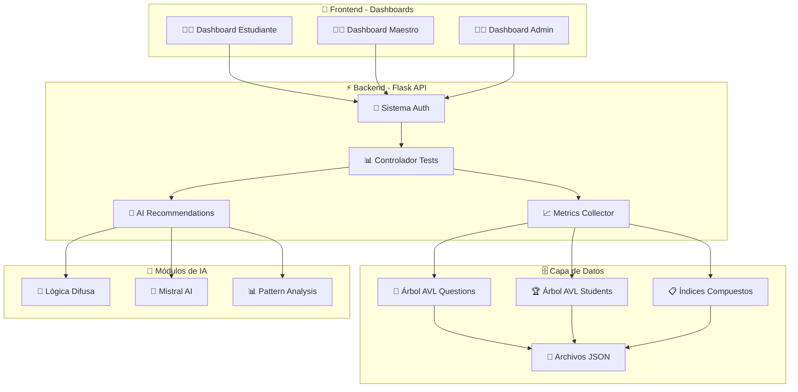

# 🧠 FuzzMap - Sistema Universitario de Exámenes Inteligente

> **Plataforma moderna de exámenes universitarios** con dashboards diferenciados, algoritmos de búsqueda avanzados, evaluación con lógica difusa y recomendaciones personalizadas con IA.

[](https://python.org)
[](https://flask.palletsprojects.com)
[](LICENSE)

---

## 📋 Tabla de Contenidos

- [🎯 Descripción del Proyecto](#-descripción-del-proyecto)
- [✨ Características Principales](#-características-principales)
- [🔄 Flujo de Trabajo](#-flujo-de-trabajo)
- [🏗️ Arquitectura del Sistema](#️-arquitectura-del-sistema)
- [ Algoritmos de Búsqueda](#-algoritmos-de-búsqueda)
- [🧠 Inteligencia Artificial](#-inteligencia-artificial)
- [🗂️ Estructura del Proyecto](#️-estructura-del-proyecto)
- [🚀 Instalación y Uso](#-instalación-y-uso)
- [👨‍💻 Equipo de Desarrollo](#-equipo-de-desarrollo)

---

## 🎯 Descripción del Proyecto

**FuzzMap** es un sistema avanzado de exámenes universitarios que combina algoritmos eficientes de búsqueda con inteligencia artificial para proporcionar una experiencia de evaluación personalizada.

### 🌟 **Sistema Multi-Rol**
- **Estudiantes**: Exámenes adaptados al nivel de cada usuario
- **Maestros**: Análisis detallado del rendimiento académico
- **Administradores**: Control completo del sistema

### 🧮 **Búsqueda Híbrida**
- **Árbol AVL**: O(log n) para organización jerárquica de preguntas
- **Índices Compuestos**: O(1) para consultas específicas
- **Búsqueda Binaria/Lineal**: Complementos para casos específicos

### 🧠 **IA Integrada**
- **Lógica Difusa**: Evaluación contextualizada de respuestas
- **Modelo Mistral**: Recomendaciones personalizadas de estudio

---

## ✨ Características Principales

### 🎓 **Sistema Educativo**
- ✅ **Exámenes Adaptativos**: Dificultad ajustada al nivel del estudiante
- ✅ **Evaluación Difusa**: Análisis multi-criterio de respuestas
- ✅ **Recomendaciones IA**: Sugerencias personalizadas de estudio

### 📊 **Dashboards Especializados**
- ✅ **Estudiante**: Progreso personal y análisis de rendimiento
- ✅ **Maestro**: Métricas por materia y estudiante con visualización
- ✅ **Admin**: Gestión completa de usuarios y sistema

### 🔍 **Algoritmos Optimizados**
- ✅ **AVL O(log n)**: Estructura jerárquica auto-balanceada
- ✅ **Hash O(1)**: Acceso inmediato para consultas frecuentes
- ✅ **Estructuras Híbridas**: Combinación según caso de uso

### 🤖 **IA y Análisis de Datos**
- ✅ **Lógica Difusa**: Evaluación contextualizada no binaria
- ✅ **Mistral 7B**: Recomendaciones de estudio personalizadas
- ✅ **Métricas Avanzadas**: Análisis predictivo de rendimiento

---

## 🔄 Flujo de Trabajo



## 🏗️ Arquitectura del Sistema



---

## 🏆 Roles y Dashboards

### 👨‍🎓 **Estudiante**
- **Exámenes Personalizados**: 10 preguntas adaptadas a su nivel
- **Progreso Visual**: Gráficos de rendimiento histórico
- **Recomendaciones IA**: Sugerencias específicas de estudio
- **Historial Completo**: Registro de todos los exámenes realizados

### 👨‍🏫 **Maestro**
- **Vista por Materia**: Métricas detalladas de las materias asignadas
- **Análisis de Estudiantes**: Rendimiento individual y grupal
- **Gráficos Interactivos**: Visualizaciones con Plotly.js
- **Exportación de Datos**: Reportes en tiempo real

### 👨‍💼 **Administrador**
- **Gestión de Usuarios**: Crear, editar, eliminar usuarios
- **Configuración de Materias**: Asignar materias a maestros
- **Monitoreo del Sistema**: Métricas globales y estado del sistema
- **Backup y Mantenimiento**: Herramientas de administración

---

## 🔍 Algoritmos de Búsqueda

### 🌳 **Árbol AVL (O(log n))**
```python
# Búsqueda principal para preguntas organizadas jerárquicamente
def buscar_pregunta_avl(materia, dificultad):
    # Auto-balanceado, garantiza O(log n) en el peor caso
    return avl_tree.search(materia, dificultad)
```

### ⚡ **Índice Compuesto (O(1))**
```python
# Acceso directo para consultas específicas materia-dificultad
def acceso_directo(materia, dificultad):
    # Hash table: acceso inmediato O(1)
    return indices_compuestos[f"{materia}_{dificultad}"]
```

### 🎯 **Búsqueda Binaria (O(log n))**
```python
# Optimización en rankings ordenados de estudiantes
def buscar_en_ranking(estudiante_id):
    # Lista ordenada: búsqueda binaria O(log n)
    return binary_search(ranking_ordenado, estudiante_id)
```

### 🔄 **Búsqueda Lineal (O(n))**
```python
# Fallback robusto para casos especiales
def busqueda_exhaustiva(criterio_especial):
    # Recorrido completo: garantiza encontrar cualquier elemento O(n)
    return linear_search(dataset, criterio_especial)
```

### 📊 **Comparación de Rendimiento**

| Algoritmo | Complejidad | Caso de Uso | Ventajas |
|-----------|-------------|-------------|----------|
| **Árbol AVL** | O(log n) | Organización jerárquica | Auto-balanceado, búsqueda rápida |
| **Índice Compuesto** | O(1) | Consultas específicas | Acceso inmediato |
| **Búsqueda Binaria** | O(log n) | Rankings ordenados | Eficiente en listas grandes |
| **Búsqueda Lineal** | O(n) | Casos especiales | Garantiza encontrar cualquier elemento |

---

## 🧠 Inteligencia Artificial

### 🔀 **Lógica Difusa**
- **Evaluación Contextual**: Más allá de respuestas exactas
- **Múltiples Criterios**: Considera tiempo, precisión, dificultad
- **Adaptación Dinámica**: Ajuste automático de parámetros

### 🤖 **Modelos de IA**
- **Mistral 7B**: Recomendaciones personalizadas de estudio
- **LM Studio**: Integración local de modelos

### 📈 **Análisis Predictivo**
- **Detección de Patrones**: Identificación automática de fortalezas/debilidades
- **Recomendaciones Específicas**: Sugerencias por materia y tema
- **Predicción de Rendimiento**: Estimación de resultados futuros

---

## 📊 Métricas y Analytics

### 📈 **Métricas por Estudiante**
- Promedio de calificaciones por materia
- Tiempo promedio de respuesta
- Progresión de dificultad
- Temas de mayor y menor rendimiento

### 📊 **Métricas por Maestro**
- Rendimiento grupal de estudiantes
- Distribución de calificaciones
- Análisis comparativo por materia
- Tendencias temporales

### 🏢 **Métricas del Sistema**
- Usuarios activos por rol
- Exámenes realizados por día/semana
- Rendimiento general del sistema
- Uso de recursos y optimización

---

## 🗂️ Estructura del Proyecto

```
FuzzMap/
├── 📁 Datos/                      # Banco de datos y métricas
│   ├── 📄 users.json              # Usuarios y roles
│   ├── 📄 metrics.json            # Métricas del sistema
│   ├── 📁 Ciencia_Datos/          # Materia 1
│   └── 📁 Habilidades_Vida/       # Materia 2
├── 📁 Modulos/                    # Core del sistema
│   ├── 📁 auth/                   # Autenticación
│   ├── 📁 avltree/                # Árboles AVL
│   ├── 📁 extraction/             # Extractor PDF
│   ├── 📁 fuzzylogic/             # Lógica difusa
│   ├── 📁 generate_questions/     # Generador IA
│   ├── 📁 metrics/                # Sistema métricas
│   ├── 📁 nlp/                    # Procesamiento lenguaje
│   └── 📁 ui/                     # Interfaz Flask
│       ├── 📄 app.py              # Backend principal
│       ├── 📁 templates/          # Dashboards HTML
│       └── 📁 src/                # Assets frontend
├── 📁 Notebooks/                  # Tests y desarrollo
├── 📄 main.py                     # Punto de entrada
└── 📄 requirements.txt            # Dependencias
```

---

## 🚀 Instalación y Uso

### 📋 **Prerrequisitos**
- **Python 3.12+** instalado en el sistema
- **Git** para clonar el repositorio
- **Navegador web moderno** (Chrome, Firefox, Edge, Safari)

### ⚡ **Instalación Rápida**

```bash
# 1. Clonar repositorio
git clone https://github.com/RosariosTijeras/fuzzmap.git
cd fuzzmap

# 2. Crear entorno virtual (Python 3.12+)
python -m venv .venv
.\.venv\Scripts\activate

# 3. Instalar dependencias
pip install -r requirements.txt

# 4. Ejecutar aplicación
python main.py
```

### 🔑 **Acceso al Sistema**

Abrir `http://localhost:5000` y usar:

| **Rol** | **Usuario** | **Contraseña** |
|---------|-------------|----------------|
| 👨‍🎓 Estudiante | ana@unach.edu.ec | ana |
| 👨‍🏫 Maestro | habilidades@unach.edu.ec | habilidades |
| 👨‍💼 Admin | admin@unach.edu.ec | admin |

### ⚙️ **Configuración IA (Opcional)**

1. Instalar [LM Studio](https://lmstudio.ai)
2. Cargar modelo Mistral 7B
3. Iniciar servidor en puerto 1234

### 🐛 **Solución Problemas**

```bash
# Puerto ocupado: Editar main.py
app.run(debug=True, port=5001)

# Módulo no encontrado
pip install -r requirements.txt --force-reinstall
```

---

## 👨‍💻 Equipo de Desarrollo

| 👤 **Desarrollador** | 🎯 **Área** | 🛠️ **Contribuciones** |
|---------------------|-------------|----------------------|
| **Mario Camacho** | Frontend & IA | • Dashboards Flask<br>• Lógica difusa<br>• Integración Mistral AI |
| **Lenin Arias** | Data Processing | • Extracción PDF<br>• Preprocesamiento<br>• Optimización datasets |
| **Yoryhi Rojas** | NLP | • Clasificación texto<br>• Análisis semántico<br>• Coincidencia patrones |
| **Héctor Quilumba** | Estructuras de Datos | • Árboles AVL<br>• Algoritmos búsqueda<br>• Complejidad algorítmica |

### 🎓 **Institución**
- **Universidad**: Universidad Nacional de Chimborazo (UNACH)
- **Facultad**: Ingeniería
- **Carrera**: Ingeniería en Ciencia de Datos e Inteligencia Artificial
- **Materias**: Estructura de Datos, Programación 2
- **Periodo**: Segundo Semestre 2025

---

## 📜 **Licencia**

Este proyecto está licenciado bajo una Licencia Propietaria. Todos los derechos reservados.

**Aviso Legal**: Este software y su código fuente son propiedad exclusiva del equipo FuzzMap. Queda estrictamente prohibida cualquier forma de uso, reproducción, modificación o distribución sin el consentimiento expreso por escrito de los autores. El uso no autorizado está sujeto a acciones legales.

---

<div align="center">

**🧠 Desarrollado con ❤️ por el Equipo FuzzMap**

*Sistema Universitario de Exámenes Inteligente*

[](https://www.unach.edu.ec)
[](https://github.com/RosariosTijeras/FuzzMap)
[](LICENSE)

</div>
